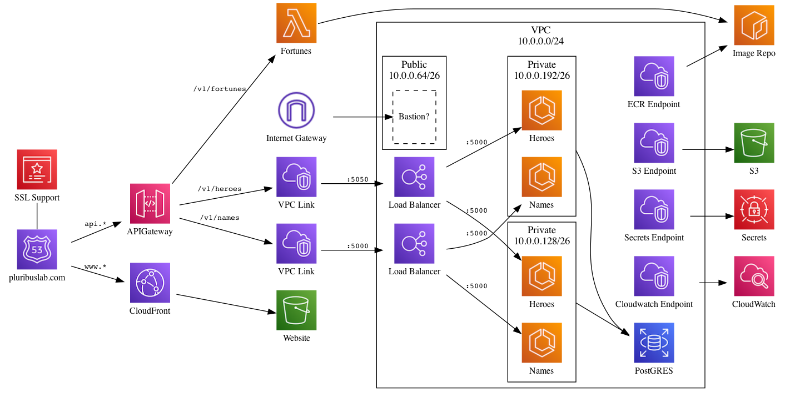

# Scaffolding an AWS project

This project can be used as the starting point for setting up an AWS environment.

## Solution Overview

See the detailed solution description below for more details.

### Repository Hierarchy

The directory structure includes:

* `/docs`: Design artifacts
* `/services`: The API and UI applications
* `/terraform`: Code for infrastructure setup

### Developer Guidance

__Before you touch any code,__ please review the [CONTRIBUTING](./CONTRIBUTING.MD) guide.

### Running Code

* [Front End Developers](./services/Front_End_Development.md)
* [API Developers](./services/API_Development.md)
* [DB Developers](./services/Database_Development.md)
* [Infrastructure team](./terraform/README.md)
